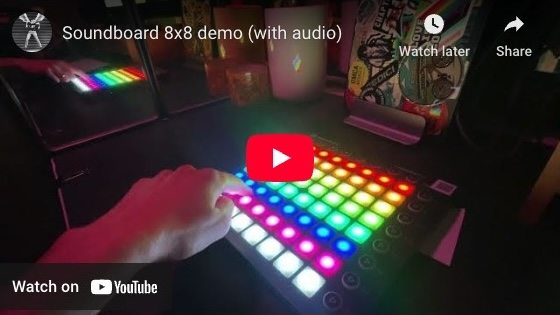
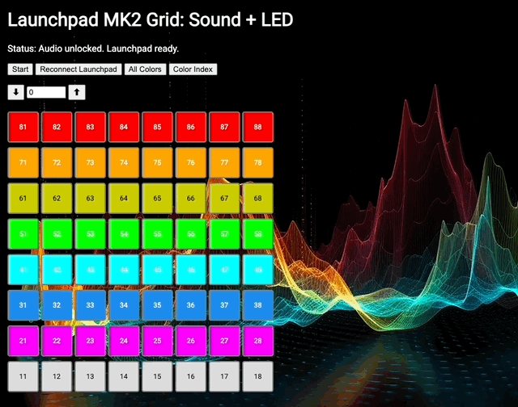

## Soundboard (for Novation Launchpad)

This is a web app that recognizes a [Novation Launchpad MK2](https://downloads.novationmusic.com/novation/launchpad-mk2) MIDI controller (connected to a computer via USB cable), and plays different sound effects when different buttons are pressed.

### Demo

Watch the [demo video on YouTube](https://youtu.be/3VgG6COkYkM):



This demo shows visuals only:



### My initial ChatGPT prompt:

> Use JavaScript and HTML to create a program that I can use in a web browser that recognizes my Novation Launchpad MK2 controller, and programs 3 unique sounds for the first 3 buttons on the top row.

### Sound effects

I am using [these sounds](https://bit.ly/4kkKtHb) from [Freesound.org](https://freesound.org/). (If you clone this repo, you will need to provide your own sounds!)

### Run the app locally

`python3 -m http.server`

### Button IDs

```
    Each pad/button on the Launchpad sends a MIDI Note On message
    with a specific note number (an integer from 0–127).
    This number uniquely identifies which pad was pressed.
    Here is the full Launchpad MK2 MIDI note number layout
    for the 8×8 grid of pads (not including side buttons).

    The tens digit represents the row. (1 thru 8)
    The ones digit represents the column. (1 thru 8)

    Top (Row 1)
    +------+------+------+------+------+------+------+------+
    |  81  |  82  |  83  |  84  |  85  |  86  |  87  |  88  |
    +------+------+------+------+------+------+------+------+
    |  71  |  72  |  73  |  74  |  75  |  76  |  77  |  78  |
    +------+------+------+------+------+------+------+------+
    |  61  |  62  |  63  |  64  |  65  |  66  |  67  |  68  |
    +------+------+------+------+------+------+------+------+
    |  51  |  52  |  53  |  54  |  55  |  56  |  57  |  58  |
    +------+------+------+------+------+------+------+------+
    |  41  |  42  |  43  |  44  |  45  |  46  |  47  |  48  |
    +------+------+------+------+------+------+------+------+
    |  31  |  32  |  33  |  34  |  35  |  36  |  37  |  38  |
    +------+------+------+------+------+------+------+------+
    |  21  |  22  |  23  |  24  |  25  |  26  |  27  |  28  |
    +------+------+------+------+------+------+------+------+
    |  11  |  12  |  13  |  14  |  15  |  16  |  17  |  18  |
    +------+------+------+------+------+------+------+------+
    Bottom (Row 8)
```

### Launchpad button colors

The MK2 uses an internal color palette, where each velocity number maps to a different LED color.

```
Minimum: 0 → turns the LED off
Maximum: 127 → highest value in the internal color palette (often white or bright)

Examples:
velocity = 5 → Red
velocity = 21 → Green
velocity = 63 → Yellow
velocity = 127 → White
```
